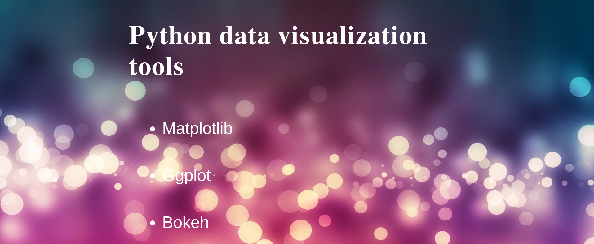
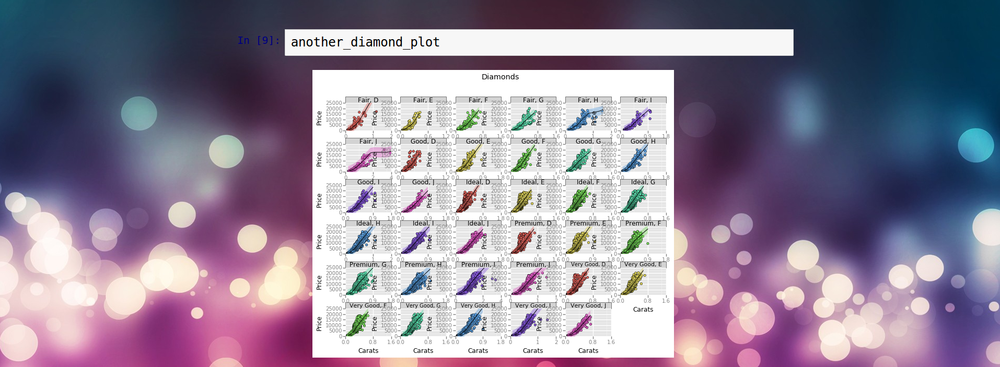
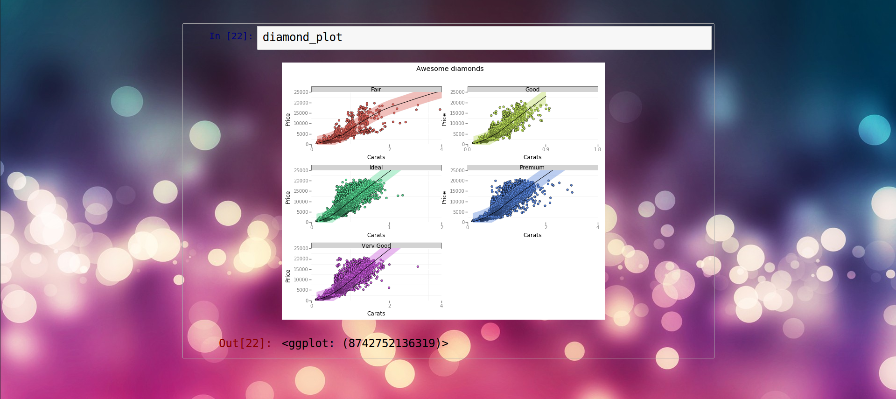
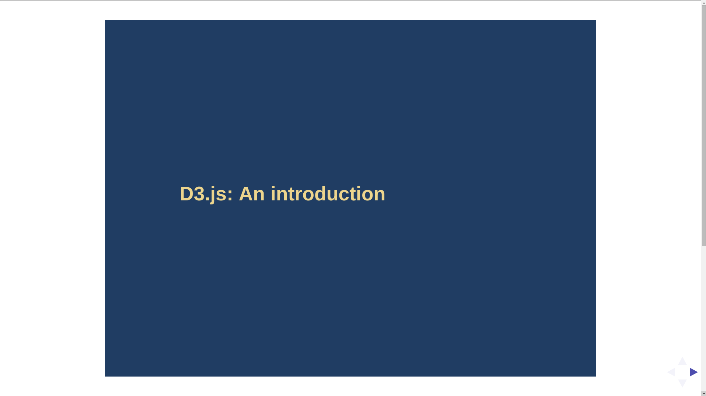
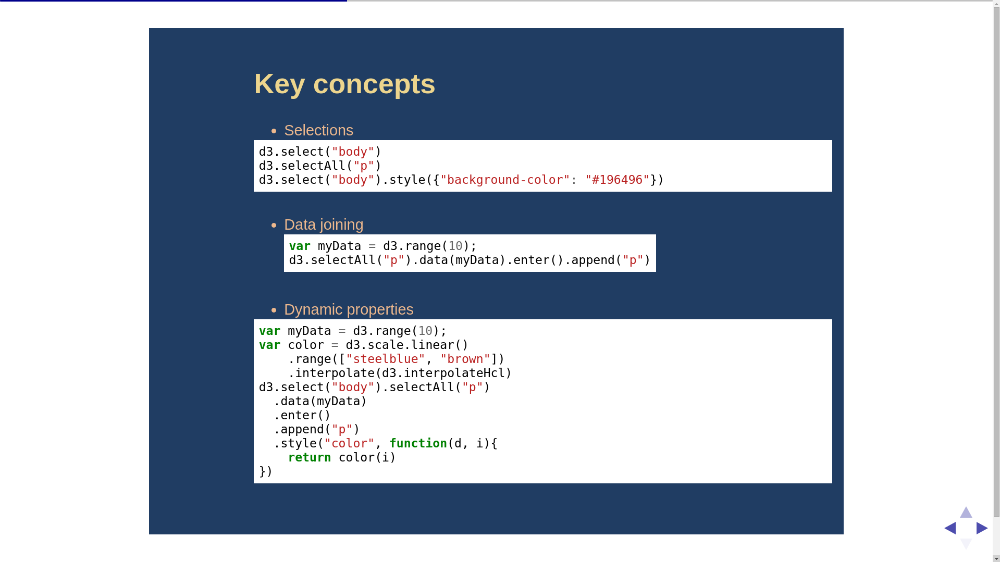
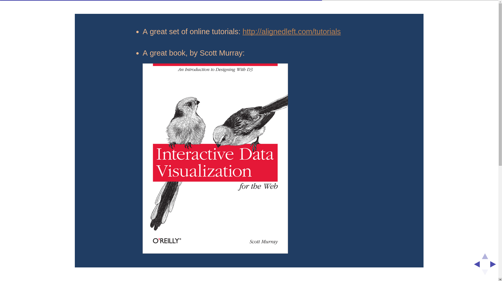

## Description

This repository contains some of my talks about visualization.

### Some screenshots of previous talks

* Python visualization tools

  

  

* D3.js: An introduction

  

  

## License

The MIT License (MIT)

Copyright (c) 2015 Yassine Alouini
